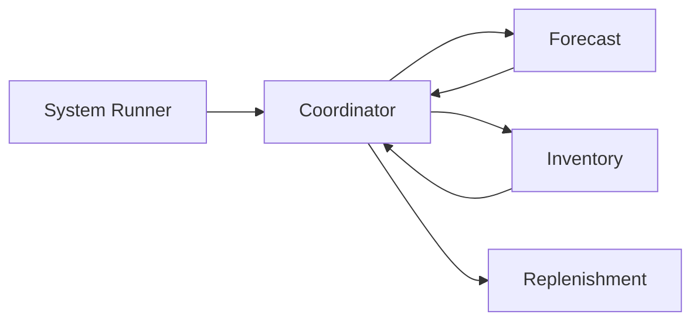
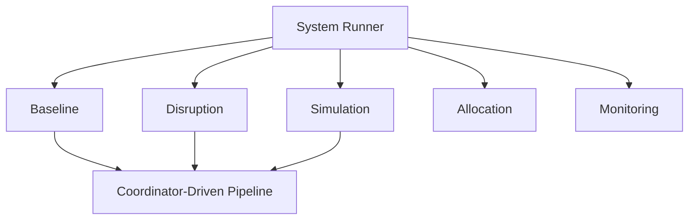

# Pipeline and Execution Architecture

## Core Flow

The coordinator is the control hub of the system.
It executes the pipeline by calling each module, transforming outputs, and passing controlled inputs downstream.

---

## Execution Modes

The system runner selects how the system runs.

* baseline, disruption, and simulation all use the same core pipeline
* allocation is a separate multi-location decision flow
* monitoring evaluates outputs after decisions

---

## Coordinator Role

* calls forecast, inventory, and replenishment in sequence
* converts forecast output into expected demand
* applies overrides (simulation, disruption)
* builds clean, structured inputs for each module
* collects outputs and produces a final decision

Rules:

* modules never call each other directly
* all communication flows through the coordinator
* demand is defined only once inside the coordinator

---

## External Modules

These operate outside the core pipeline:

* disruption → modifies inputs before execution
* simulation → runs multiple scenarios through the pipeline
* allocation → solves multi-location decisions separately
* monitoring → evaluates performance and risk

They do not change the structure of the core pipeline.

---

## Dependency Flow

Coordinator → Forecast → Inventory → Replenishment (controlled execution)

---

## Data Separation

* DataFrame layer → modeling and computation
* Dataclass layer → system interfaces and contracts

This enforces clean boundaries and prevents raw data from leaking into decision logic.

---

## Key Rules

* execution is coordinator-driven
* pipeline is sequential but centrally controlled
* modules are independent and loosely coupled
* orchestration is separate from domain logic
* external modules modify inputs or evaluate outputs only

---

## One-Line Summary

A coordinator-driven system where execution is centrally controlled, demand is standardized before decision-making, and all modes reuse the same deterministic pipeline.
