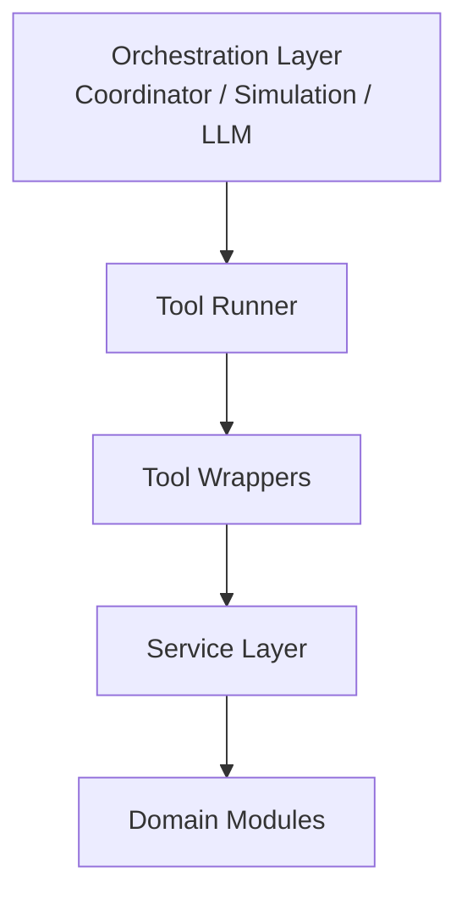

# Tool Interface Layer

## Purpose

The Tool Interface Layer provides a **stable interaction boundary between orchestration and domain logic**.

Higher-level components do not call forecasting, inventory, or replenishment modules directly.  
They interact through standardized tools.

This keeps the system modular and enables higher-level components such as:

- decision coordinator  
- simulation engine  
- disruption modules  
- allocation logic  
- LLM reasoning  
- agent workflows  

The tool layer acts as the **controlled gateway into system capabilities**.

---

## One-Line Summary

The tool layer exposes system capabilities as **stable, callable operations with strict interfaces**.

---

## System Position



**Mental hook:** the tool layer is the **API surface of the system**.

---

## Why the Tool Layer Exists

Domain modules expose useful functionality but are not suitable as system interfaces.

### Forecasting
Requires:
- model
- historical data
- horizon

### Inventory
Returns:
- inventory position
- days of supply
- stockout risk

### Replenishment
Returns:
- reorder decision
- quantity
- logic

These are inconsistent and low-level.

The tool layer standardizes them into **clean, consistent operations**.

**Key idea:** tools define **what the system can do**, not how it does it.

---

## Tool Layer Structure

Location:

`src/tools/`

Core files:

- `schemas.py`
- `forecast_tool.py`
- `inventory_tool.py`
- `replenishment_tool.py`
- `runner.py`

---

## Tool Schemas

Define strict input/output contracts.

Examples:

- `ForecastToolInput / Output`
- `InventoryStatusToolInput / Output`
- `ReplenishmentToolInput / Output`

Schemas enforce:

- required inputs
- structured outputs
- consistency across tools

**Mental hook:** schemas = system contracts

---

## Tool Wrappers

Each tool wraps a domain capability and exposes it in a standardized format.

- Forecast Tool → demand prediction  
- Inventory Tool → inventory evaluation  
- Replenishment Tool → decision generation  

Tools:

- do NOT contain business logic  
- only expose existing logic  

**Mental hook:** wrappers translate **requests → domain execution**

---

## Tool Runner

Central execution entry point:

`run_tool(tool_name, input_data)`

Examples:

- `run_tool("forecast", input)`
- `run_tool("inventory_status", input)`
- `run_tool("replenishment", input)`

The runner allows orchestration to call tools **without knowing implementation details**.

**Mental hook:** runner = command dispatcher

---

## Runner Responsibilities

1. receive tool name  
2. validate input  
3. route execution  
4. return output  

The runner does NOT decide which tool to use.

That responsibility belongs to:

- coordinator  
- simulation  
- agents  
- LLM systems  

---

## Dynamic Execution

Tools are executed by name at runtime.

This enables:

- flexible orchestration  
- agent-driven workflows  
- simulation branching  

While schemas maintain safety and consistency.

**Mental hook:** dynamic execution = flexibility with control

---

## Dependency Direction

```text
tools
↓
services
↓
domain modules
```

- tools depend on services  
- services depend on domain logic  
- domain must never depend on tools  

This prevents tight coupling and circular dependencies.

---

## Architecture Role

The tool layer converts independent modules into a **coherent system**.

It provides:

- standardized interfaces  
- centralized execution  
- modular access  
- orchestration compatibility  

This enables:

- decision pipelines  
- simulations  
- disruption analysis  
- LLM reasoning  

without breaking modularity.

---

## Mental Model

domain modules → internal logic  
tools → callable operations  
runner → execution gateway  
orchestration → decision maker  

---

## Readiness

The tool layer is:

- modular  
- extensible  
- consistent  
- orchestration-ready  

It provides the correct abstraction for scaling the system without coupling layers.